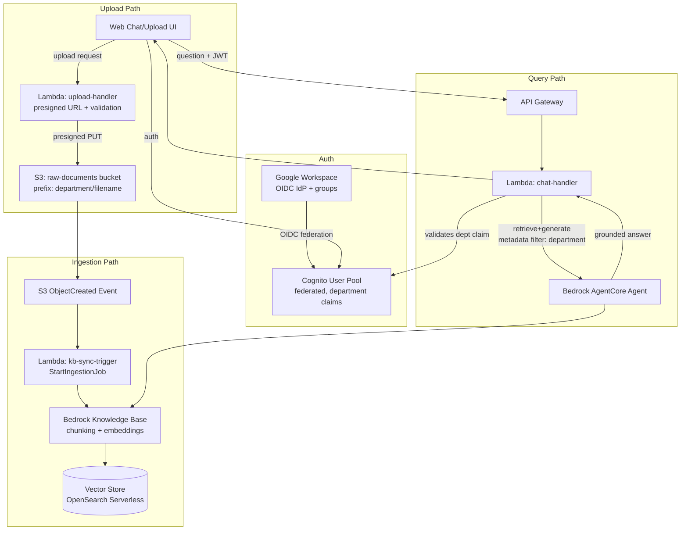

# Internal RAG Knowledge Agent — Specification (Draft v1)

## 1. Summary

An internal, ChatGPT-style assistant that answers employee questions **strictly from company documents**. Employees upload files (scoped to their department) to S3; ingestion is triggered automatically and synced into a Bedrock Knowledge Base; a chat agent (built on Bedrock AgentCore) answers queries grounded only in documents the requesting user's department is allowed to see.

Fully serverless: S3, Lambda, API Gateway, Cognito, Bedrock (Knowledge Base + AgentCore). No always-on compute.

## 2. Goals / Non-Goals

**Goals**
- Answers are grounded only in ingested company documents (no un-sourced model knowledge).
- Department-scoped visibility: a user only gets answers from documents their department(s) can access.
- Upload → searchable knowledge with no manual ingestion step.
- Standard office document support: PDF, DOCX, TXT, PPTX.

**Non-Goals (this draft)**
- Fine-grained per-document or per-user ACLs (only department-level scoping).
- Real-time collaborative editing or document versioning workflows.
- Non-office structured data sources (databases, CSV, Confluence/wiki exports) — deferred.
- Multi-tenant (multiple companies) support.

## 3. Architecture Overview

## 4. Components

### 4.1 Identity — Cognito federated with Google Workspace
- Cognito User Pool is configured with **Google Workspace as an OIDC identity provider** — no native Cognito users/passwords; employees authenticate via their existing Google Workspace login.
- Department membership comes from **Google Workspace groups**, mapped into Cognito group claims at federation time (one Workspace group ↔ one department, e.g. `dept-engineering@company.com` → `dept-engineering`).
- A reserved **`company-wide`** department value is implicitly granted to every authenticated user (see 4.2/4.4), independent of Workspace group membership.
- A user may belong to multiple department groups; the ID token carries all of them, and access is the **union** of those departments plus `company-wide`.
- ID token issued to the frontend carries department claim(s), used both for upload tagging and query-time filtering.

### 4.2 Upload path
- Frontend requests a **presigned S3 upload URL** from `upload-handler` Lambda, passing the target department (validated against the caller's federated group membership — a user cannot upload into a department they don't belong to, except `company-wide`, which anyone may upload to).
- Object key convention: `s3://raw-documents/{department}/{uuid}-{original-filename}`, where `{department}` may be `company-wide`.
- `upload-handler` also writes/validates S3 object metadata (`x-amz-meta-department`) redundantly, since the Knowledge Base ingestion needs a reliable, tamper-resistant field to filter on later (prefix alone is fine for filtering client-side, but Bedrock KB metadata filtering works off a metadata JSON sidecar or object tags — see 4.3).

### 4.3 Ingestion path
- S3 `ObjectCreated` event → `kb-sync-trigger` Lambda.
- Lambda writes a `<filename>.metadata.json` sidecar (Bedrock KB convention) containing `{"metadataAttributes": {"department": "<dept>"}}` alongside the object, then calls `StartIngestionJob` on the Bedrock Knowledge Base data source.
- Bedrock KB handles chunking, embedding, and upsert into the vector store (OpenSearch Serverless, AWS-managed default).
- Batching consideration: bursty uploads could trigger many overlapping `StartIngestionJob` calls — Bedrock KB queues/serializes ingestion jobs per data source, but we should debounce (e.g. SQS + short delay window) if upload volume is high. Not a concern at the confirmed launch scale (< 500 docs, < 50 users) — revisit if volume grows.
- **Failure handling**: on parse/ingestion failure, retry with backoff; if retries are exhausted, route to a dead-letter queue (SQS DLQ) for manual review. Exact retry count/backoff and whether the uploader or an ops channel gets notified on DLQ landing is still to be defined during implementation (see [questionnaire](./rag-knowledge-agent-questionnaire.md), Q4).

### 4.4 Query path
- Frontend sends question + Cognito ID token to API Gateway (JWT authorizer validates token, extracts department claim(s)).
- `chat-handler` Lambda invokes the Bedrock AgentCore agent, passing the user's department(s) **plus `company-wide`** as a **retrieval metadata filter** (`department IN (user's departments + "company-wide")`), so retrieval-augmented generation only pulls chunks tagged for departments the user belongs to (or company-wide docs).
- AgentCore agent performs retrieve-and-generate against the Knowledge Base with that filter applied, returns grounded answer with citations.
- `chat-handler` persists the turn to a **per-user conversation store** (DynamoDB, keyed by user ID) so context carries across sessions, not just within one chat session. Retention/TTL policy TBD.
- `chat-handler` returns the answer + source document citations to the frontend. For each citation, it generates a **presigned download URL** to the original S3 object, re-validating the requesting user's department access at link-generation time (not just at query time) — so a user who has since lost department access can't use a stale citation link.

### 4.5 Frontend
- Web chat UI (React or similar), login via Cognito Hosted UI federated to Google Workspace.
- Chat view for querying (with persistent conversation history across sessions) and inline source citations with download links; a separate upload view for submitting documents with a department picker (constrained to the user's own group memberships, plus `company-wide`).

## 5. Data Model / Conventions

| Item | Convention |
|---|---|
| S3 bucket | `raw-documents` (per-environment: `raw-documents-dev`, `-staging`, `-prod`) |
| Object key | `{department}/{uuid}-{original-filename}`, `{department}` may be `company-wide` |
| KB metadata sidecar | `{key}.metadata.json` → `{"metadataAttributes": {"department": "<dept>"}}` |
| Department claim source | Google Workspace group → Cognito group claim, e.g. `dept-engineering`, `dept-finance`, plus reserved `company-wide` |
| Supported file types | `.pdf`, `.docx`, `.txt`, `.pptx` (Bedrock KB default parsers) |
| Conversation store | DynamoDB, keyed by user ID (persistent across sessions) |
| Environments | `dev`, `staging`, `prod` — account structure (single vs. multi-account) TBD |

## 6. Security Considerations
- All access to S3 and the Knowledge Base is via Lambda execution roles — no direct client access to S3 or Bedrock.
- Presigned URLs (both upload and citation download links) are short-lived and scoped to a single key; citation download links are re-validated against current department access at generation time, not cached from query time.
- Department claim used for filtering must come from a verified JWT (API Gateway JWT authorizer, backed by Google Workspace OIDC federation), never a client-supplied field.
- Users cannot upload into a department they aren't a member of, except the reserved `company-wide` department (enforced server-side in `upload-handler`, not just client-side UI).
- A user with zero department groups still gets `company-wide` access only — no special-case handling needed beyond that.

## 7. Open Questions — Resolved

All items from the original open-questions list were answered via the [questionnaire](./rag-knowledge-agent-questionnaire.md) on 2026-07-18 and are reflected in the sections above (identity/federation in 4.1, company-wide docs in 4.2/4.4, multi-department union in 4.1/4.4, ingestion retry/DLQ in 4.3, conversation persistence in 4.4, citations in 4.4, environments in 5, launch scale below).

**Remaining sub-decisions** (not blocking, to resolve during implementation):
- Google Workspace OIDC app registration details and exact Workspace-group-to-department naming convention.
- DLQ retry count/backoff, and whether the uploader or an ops channel is notified when a document lands in the DLQ.
- Conversation history retention/TTL policy in DynamoDB.
- Account structure for dev/staging/prod — single AWS account with environment-prefixed resources vs. separate accounts per environment.
- Document growth rate and query volume were not estimated — launch scale is confirmed small (< 500 docs, < 50 users), which keeps OpenSearch Serverless and Lambda sizing low-risk for v1, but growth-rate estimates would help set autoscaling/cost alarms.

## 8. Launch Scale (confirmed)

- Documents at launch: **< 500**
- Active users: **< 50**
- Document sizes: **typical office docs**, no large-document (500+ page) handling needed for v1.

This keeps OpenSearch Serverless capacity and Lambda concurrency requirements modest for the initial launch; revisit sizing if adoption grows materially beyond these numbers.

## 9. Suggested Phases

1. **Phase 1 — Core pipeline**: S3 bucket, single-department (no filtering) Knowledge Base, ingestion Lambda, basic chat Lambda + AgentCore agent, no auth (internal testing only).
2. **Phase 2 — Identity & scoping**: Cognito federated with Google Workspace, department + `company-wide` claims, metadata tagging, retrieval-time filtering (union of departments + company-wide).
3. **Phase 3 — Frontend**: web chat + upload UI, gated citation download links, persistent cross-session conversation history.
4. **Phase 4 — Hardening**: ingestion retry/DLQ with notification, monitoring/alarms, cost tuning, dev/staging/prod environment setup.
